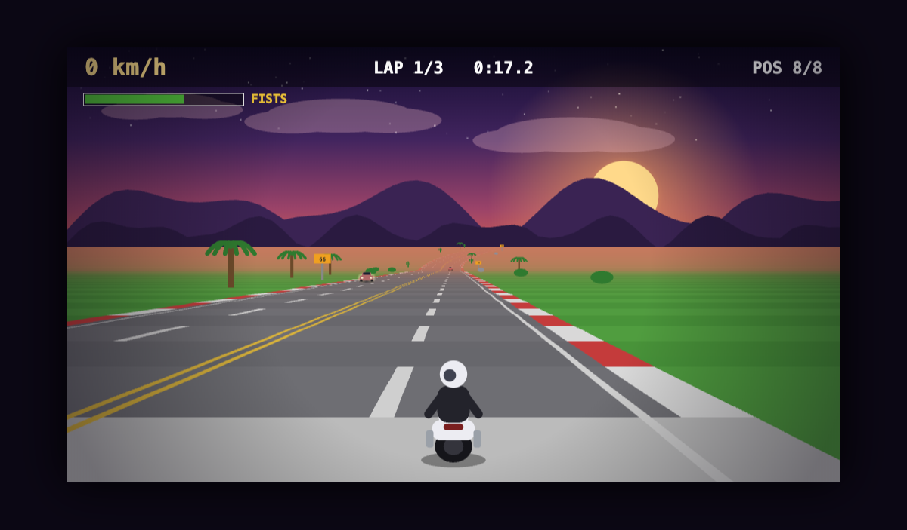

# 🏍️ Road Clash

A pseudo-3D, **Road Rash–style combat racer** that runs entirely in the browser. Race AI rivals solo, or **create a room, share the link, and brawl with friends online** — no install, no game server, no accounts.



> Lightweight by design: TypeScript + Canvas 2D + WebRTC. The whole game is a few KB of code plus two images — procedural art and audio, zero asset bloat.

---

## ✨ Features

- **Pseudo-3D racing** down a curving, hilly, two-way highway with drafting, slopes, and slipstream.
- **Combat** — punch rivals to knock them down and **snatch their CLUB or CHAIN** for more reach and damage.
- **Heat & cops** — knockdowns raise your HEAT; enough of it brings the police. Crash near them and you're **BUSTED**.
- **3 seasons** — **Summer**, **Winter**, and **Rainy**, each re-skinning the world and changing grip. **Rainy roads are slippery.**
- **Two ways to play**
  - **Solo** vs a full grid of AI riders.
  - **Multiplayer** — peer-to-peer over WebRTC. Create a room, share the **code or link**, friends join over the internet. Empty slots are filled by AI.
- **Pause** (solo) with a subtle ambient track and a **3 · 2 · 1** resume countdown.
- **Keyboard and touch** controls, **procedural audio** (synth engine, wind, siren), and settings that persist locally.

## 🎮 Controls

| Input | Action |
|-------|--------|
| `↑` | Accelerate |
| `↓` | Brake |
| `←` `→` | Steer & lean |
| `A` / `Space` | Punch / attack |
| `Esc` | Pause (solo) |
| `M` | Mute |
| **Touch** | Hold a screen half to steer · on-screen BRAKE + PUNCH · auto-throttle |

## 🏁 How to play

- **Win the race** — finish the laps ahead of the pack.
- **Fight dirty** — knock rivals down and steal their weapons.
- **Watch the traffic** — it's two-way; oncoming cars are lethal and rear-ending anything at speed wipes you out.
- **Draft** — tuck in behind a vehicle for a slipstream speed boost.
- **Pick your season** in Settings — rainy demands a lighter touch on the bars.

## 🌐 Multiplayer (how it works)

Each player is the **authority over their own bike** and simulates it instantly (client-side prediction), so controls feel local regardless of ping. Remote riders arrive as **snapshots interpolated ~120 ms in the past**, hiding jitter. The host broadcasts a shared **seed + season + laps**, so every peer builds an identical track.

Transport is **serverless P2P** over WebRTC (via [Trystero](https://github.com/dmotz/trystero), Nostr strategy for peer discovery). There is nothing to host or pay for. A small fraction of strict/corporate networks block direct peer connections — for those, a future WebSocket/TURN relay can be dropped in behind the existing `Transport` interface without touching the game.

## 🧱 Tech stack & architecture

**TypeScript · Vite · HTML5 Canvas 2D · WebRTC (Trystero).** No frameworks, no rendering libraries.

The codebase puts clean seams exactly where behaviour changes — networking, game modes, and UI — while keeping the tuned simulation/render core cohesive:

```
src/
├── main.ts              # bootstrap: wires Session → Engine → render loop
├── core/                # constants · settings · math · rng (seedable) · state · types · view
├── engine/              # track · physics · render · sprites · audio · seasons · particles · hud
├── entities/            # riders (AI + remote share one shape) · traffic
├── net/                 # transport (interface) · trysteroTransport · protocol · snapshot
├── session/             # session (base) · soloSession · multiplayerSession   (Strategy)
└── ui/                  # input (keyboard + touch) · menu (DOM overlay)
```

Design highlights:
- **`Transport` interface (DIP)** — sessions depend on an abstraction, never on Trystero. Swap P2P for a relay by writing one file.
- **`Session` strategy** — solo and multiplayer are interchangeable to the main loop (Liskov).
- **Uniform riders** — an AI rider and a networked human are the same shape; the renderer can't tell them apart.
- **Seeded RNG** — deterministic tracks across peers.

## 🛠️ Develop

Requires Node 20+.

```bash
npm install
npm run dev         # dev server at http://localhost:2912
npm run typecheck   # tsc --noEmit
npm run build       # production bundle → dist/
npm run preview     # serve the production build
```

## 🚀 Deploy (Vercel)

Hosted on **Vercel** — import the repo once (Add New → Project), it auto-detects Vite (build `npm run build`, output `dist`), and **every push to `main` auto-deploys**. No CLI or config needed. Cloudflare Pages works equally well (same build command + `dist` output) if you prefer.

## 📚 Docs

- [docs/FEATURES.md](docs/FEATURES.md) — complete feature list (+ what's deferred)
- [docs/ARCHITECTURE.md](docs/ARCHITECTURE.md) — module map, seams, netcode, extension recipes
- [docs/CHANGELOG.md](docs/CHANGELOG.md) — release notes / version history

## 📄 License

[MIT](LICENSE) © Aniket Ravindra Charjan
