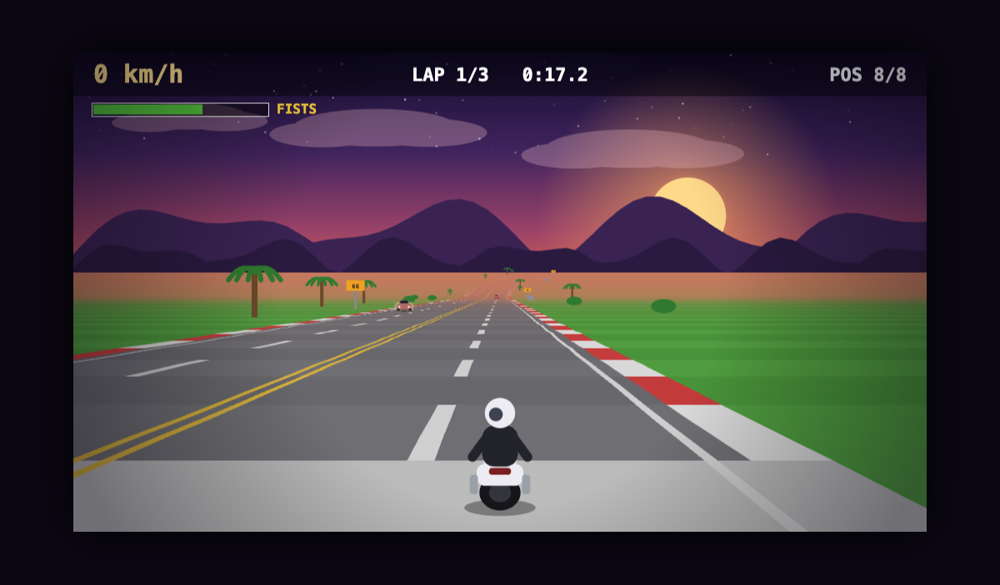

# 🏍️ Road Clash

[](https://github.com/jason-bourne-gg/road-clash/actions/workflows/ci.yml)

A pseudo-3D, **Road Rash–style combat racer** that runs entirely in the browser. Race AI rivals solo, or **create a room, share the link, and brawl with friends online** — no install, no game server, no accounts.

**Play it:** https://road-clash.vercel.app



> Lightweight by design: TypeScript + Canvas 2D + WebRTC. The whole game is a few KB of code plus two images — procedural art and audio, zero asset bloat.

---

## ✨ Features

- **Pseudo-3D racing** down a curving, hilly, two-way highway with drafting, slopes, and slipstream.
- **Combat** — punch rivals to knock them down and **snatch their CLUB or CHAIN** for more reach and damage.
- **Heat & cops** — knockdowns raise your HEAT; enough of it brings the police. Crash near them and you're **BUSTED**.
- **3 seasons** — **Summer**, **Winter**, and **Rainy**, each re-skinning the world and changing grip. **Rainy roads are slippery.**
- **Two ways to play**
  - **Solo** vs a full grid of AI riders.
  - **Multiplayer** — peer-to-peer over WebRTC. Create a room, share the **code or link**, friends join over the internet. Empty slots are filled by AI.
- **Pause** (solo) with a subtle ambient track and a **3 · 2 · 1** resume countdown.
- **Keyboard and touch** controls, **procedural audio** (synth engine, wind, siren), and settings that persist locally.

---

## 🎮 Controls

| Input | Action |
|-------|--------|
| `↑` | Accelerate |
| `↓` | Brake |
| `←` `→` | Steer & lean |
| `A` / `Space` | Punch / attack |
| `Esc` | Pause (solo) |
| `M` | Mute |
| **Touch** | Hold a screen half to steer · on-screen BRAKE + PUNCH · auto-throttle |

---

## 🏁 How to play

- **Win the race** — finish the laps ahead of the pack.
- **Fight dirty** — knock rivals down and steal their weapons.
- **Watch the traffic** — it's two-way; oncoming cars are lethal and rear-ending anything at speed wipes you out.
- **Draft** — tuck in behind a vehicle for a slipstream speed boost.
- **Pick your season** in Settings — rainy demands a lighter touch on the bars.

---

## 🧱 Design

**TypeScript · Vite · Canvas 2D · WebRTC.** No frameworks, no rendering libraries.

- **`Transport` interface** — sessions depend on an abstraction, never on Trystero. Swapping P2P for a relay is one new file.
- **`Session` strategy** — solo and multiplayer are interchangeable to the main loop.
- **Uniform riders** — an AI rider and a networked human are the same shape; the renderer can't tell them apart.
- **Seeded RNG** — every peer builds an identical track from the host's seed.

Client-side prediction keeps controls local-feeling; remotes are interpolated
120 ms in the past to hide jitter. [The full picture](docs/ARCHITECTURE.md).

---

## 🛠️ Develop

Requires Node 20+.

```bash
npm install
npm run dev         # dev server at http://localhost:2912
npm run typecheck   # tsc --noEmit
npm run build       # production bundle → dist/
npm run preview     # serve the production build
```

---

## 🚀 Deploy (Vercel)

Hosted on **Vercel** — import the repo once (Add New → Project), it auto-detects Vite (build `npm run build`, output `dist`), and **every push to `main` auto-deploys**. No CLI or config needed. Cloudflare Pages works equally well (same build command + `dist` output) if you prefer.

---

## 📚 Docs

- [docs/FEATURES.md](docs/FEATURES.md) — complete feature list (+ what's deferred)
- [docs/ARCHITECTURE.md](docs/ARCHITECTURE.md) — the pseudo-3D renderer, the P2P netcode, module map, seams and extension recipes
- [docs/CHANGELOG.md](docs/CHANGELOG.md) — release notes / version history

---

## 📄 License

[MIT](LICENSE) © Aniket Ravindra Charjan
